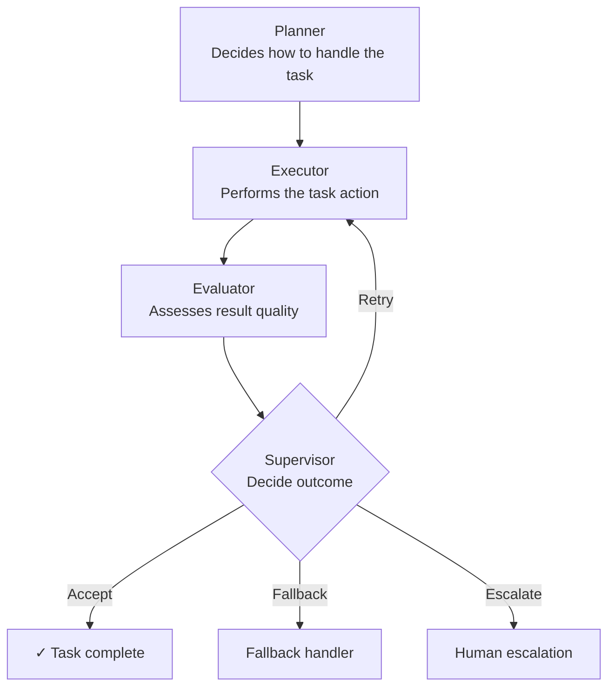

# Agent System Simulator

[](https://python.org)
[](LICENSE)
[](https://github.com/simaba/agent-simulator/commits/main)

A small, runnable simulator for controlled multi-agent workflows — demonstrating governance, orchestration, and evaluation through working code rather than documentation alone.

---

## Why this exists

Agent systems are easy to describe but hard to reason about without running them. This simulator gives you a concrete, inspectable implementation of the core governance patterns: explicit roles, bounded retries, fallback paths, escalation triggers, and evaluation.

The design principle: a well-governed agent system should expose its control logic clearly enough to be debugged, evaluated, and improved.

---

## How it works



---

## Agents

| Agent | Role |
|-------|------|
| **Planner** | Determines the strategy for handling the task |
| **Executor** | Performs the primary task action |
| **Evaluator** | Assesses whether the result meets acceptance criteria |
| **Supervisor** | Decides: accept, retry, fallback, or escalate |

---

## Quick start

```bash
git clone https://github.com/simaba/agent-simulator.git
cd agent-simulator
python run_demo.py --scenario normal_success
```

This repository currently uses only the Python standard library, so no third-party installation step is required.

Available scenarios:

```bash
python run_demo.py --scenario normal_success
python run_demo.py --scenario retry_then_success
python run_demo.py --scenario fallback_after_failure
```

---

## What each run produces

- Decision log with full agent interaction trace
- Retry and escalation events
- Final outcome status
- Latency measurements
- Cost estimate
- Evaluation summary metrics

See `examples/sample-output.md` for a full example run.

---

## Repository structure

```text
run_demo.py             # Entry point
src/
  agents.py             # Agent role implementations
  controller.py         # Orchestration and retry logic
  evaluation.py         # Evaluation criteria
  scenarios.py          # Scenario definitions
examples/
  sample-output.md      # Example run output
requirements.txt        # Reserved for future optional dependencies
```

---

## Companion repositories

- **[Multi-Agent Governance Framework](https://github.com/simaba/multi-agent-governance)** — the conceptual blueprint this simulator implements
- **[AI Agent Evaluation Framework](https://github.com/simaba/agent-eval)** — evaluation dimensions mapped to this simulator's outputs

---

## Related repositories

This repository is part of a connected toolkit for responsible AI operations:

| Repository | Purpose |
|-----------|---------|
| [Enterprise AI Governance Playbook](https://github.com/simaba/governance-playbook) | End-to-end AI operating model from intake to improvement |
| [AI Release Governance Framework](https://github.com/simaba/release-governance) | Risk-based release gates for AI systems |
| [AI Release Readiness Checklist](https://github.com/simaba/release-checklist) | Risk-tiered pre-release checklists with CLI tool |
| [AI Accountability Design Patterns](https://github.com/simaba/accountability-patterns) | Patterns for human oversight and escalation |
| [Multi-Agent Governance Framework](https://github.com/simaba/multi-agent-governance) | Roles, authority, and escalation for agent systems |
| [Multi-Agent Orchestration Patterns](https://github.com/simaba/agent-orchestration) | Sequential, parallel, and feedback-loop patterns |
| [AI Agent Evaluation Framework](https://github.com/simaba/agent-eval) | System-level evaluation across 5 dimensions |
| [Agent System Simulator](https://github.com/simaba/agent-simulator) | Runnable multi-agent simulator with governance controls |
| [LLM-powered Lean Six Sigma](https://github.com/simaba/lean-ai-ops) | AI copilot for structured process improvement |

---

*Shared in a personal capacity. Open to collaborations and feedback — connect on [LinkedIn](https://linkedin.com/in/simaba) or [Medium](https://medium.com/@bagheri.sima).*