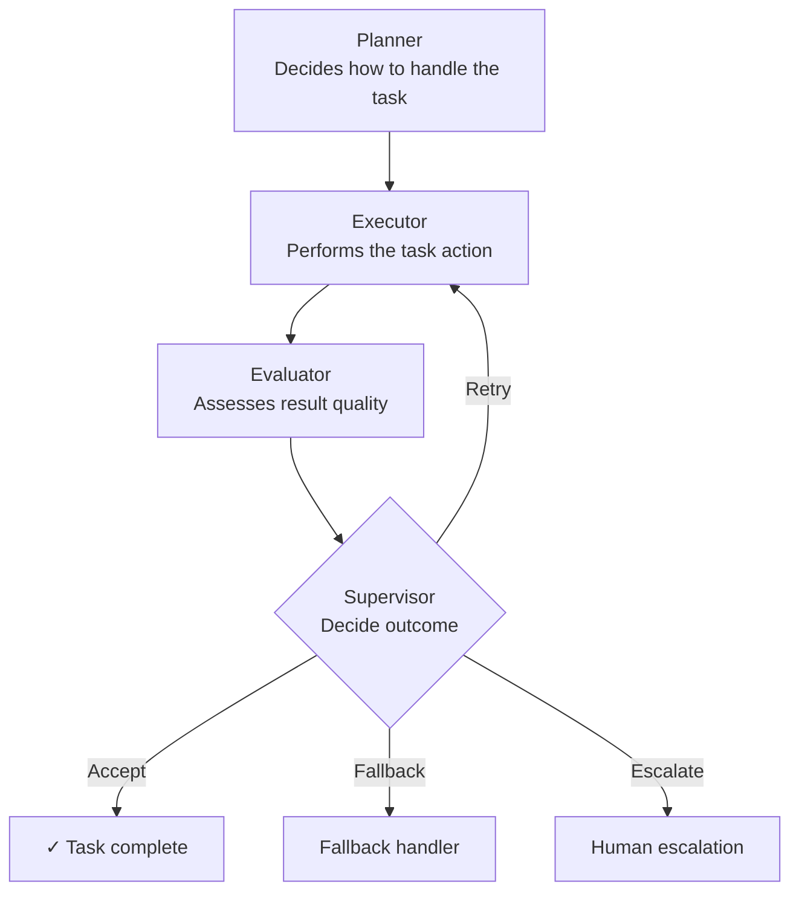

# Agent System Simulator

[](https://python.org)
[](LICENSE)
[](https://github.com/simaba/agent-simulator/commits/main)

A small, runnable simulator for controlled multi-agent workflows, demonstrating governance, orchestration, and evaluation through working code rather than documentation alone.

## Choose this repo when

Use this repository when you want a **concrete executable example** of:

- bounded retries
- fallback behavior
- escalation logic
- evaluator-driven acceptance
- traceable decision logs

This repo is intentionally narrower than:

- [`multi-agent-governance`](https://github.com/simaba/multi-agent-governance), which defines the governance model
- [`agent-orchestration`](https://github.com/simaba/agent-orchestration), which catalogs orchestration patterns
- [`agent-eval`](https://github.com/simaba/agent-eval), which defines broader evaluation dimensions and scenarios

## Why this exists

Agent systems are easy to describe but hard to reason about without running them. This simulator gives you a concrete, inspectable implementation of the core control patterns: explicit roles, bounded retries, fallback paths, escalation triggers, and evaluation.

The design principle is simple: a well-governed agent system should expose its control logic clearly enough to be debugged, tested, evaluated, and improved.

## How it works



## Agents

| Agent | Role |
|-------|------|
| **Planner** | Determines the strategy for handling the task |
| **Executor** | Performs the primary task action |
| **Evaluator** | Assesses whether the result meets acceptance criteria |
| **Supervisor** | Decides whether to accept, retry, fallback, or escalate |

## Quick start

Run the simulator directly:

```bash
git clone https://github.com/simaba/agent-simulator.git
cd agent-simulator
python run_demo.py --scenario normal_success
```

Available scenarios:

```bash
python run_demo.py --scenario normal_success
python run_demo.py --scenario retry_then_success
python run_demo.py --scenario fallback_after_failure
```

Run tests:

```bash
python -m pip install -e ".[dev]"
pytest
```

This repository currently uses only the Python standard library for runtime behavior. The optional dev dependency is only for tests.

## What each run produces

- decision log with full agent interaction trace
- retry and escalation events
- final outcome status
- latency measurements
- cost estimate
- evaluation summary metrics

See `examples/sample-output.md` for a full example run.

## Repository structure

```text
run_demo.py             # Entry point
src/
  agents.py             # Agent role implementations
  controller.py         # Orchestration and retry logic
  evaluation.py         # Evaluation report shape and rendering
  scenarios.py          # Scenario definitions
tests/
  test_controller.py    # Scenario coverage tests
examples/
  sample-output.md      # Example run output
requirements.txt        # Runtime dependency note
pyproject.toml          # Packaging and test configuration
```

## Related repositories

| Repository | What it adds |
|---|---|
| [multi-agent-governance](https://github.com/simaba/multi-agent-governance) | Governance model for multi-agent systems |
| [agent-orchestration](https://github.com/simaba/agent-orchestration) | Broader orchestration pattern catalog |
| [agent-eval](https://github.com/simaba/agent-eval) | Evaluation framework and scenario dimensions |
| [lean-ai-ops](https://github.com/simaba/lean-ai-ops) | Another runnable repo that applies structured logic to a different domain |

---

*Shared in a personal capacity. Open to collaborations and feedback via [LinkedIn](https://linkedin.com/in/simaba) or [Medium](https://medium.com/@bagheri.sima).*
